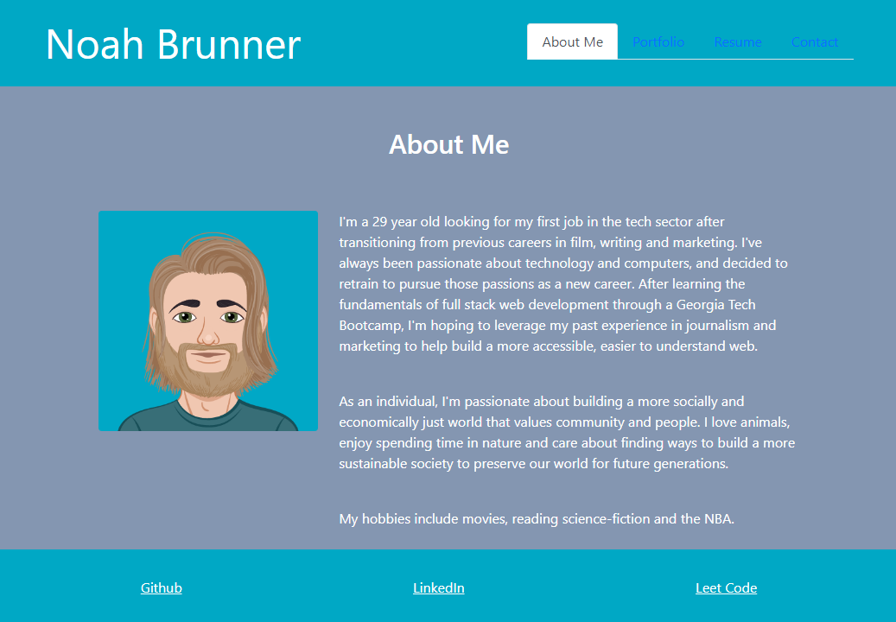

# React Portfolio

A portfolio highlighting my experience and previous projects as a web developer, written in React.

## Usage

Here's a screenshot showcasing the site's design: 

To use it, simply navigate through the tabs in the upper right hand corner, or click the links in the footer to check out my Github, LinkedIn and LeetCode profiles. 

The site can be viewed live [here](https://noahneville.github.io/noah-brunner-portfolio/).

## License

MIT License

## Contributing

Thanks to Lina Choi and James Edwards for helping me figure out a bug in my footer.

Thanks to my tutor, Dan Ringenbach, for helping implement the onBlur functionality in the Contact form. 

---
### Acceptance Criteria: 40%

Technical 

  * Application must use React to render content.

  * Application has a single `Header` component that appears on multiple pages, with a `Navigation` component within  it that’s used to conditionally render About Me, Portfolio, Contact, and Resume sections.

  * Application has a single `Project` component that’s used multiple times in the Portfolio section.

  * Application has a single `Footer` component that appears on multiple pages.

  * Application must be deployed to GitHub Pages.

Deployment: 32%

* Application deployed at live URL.

* Application loads with no errors.

* Application GitHub URL submitted.

* GitHub repository contains application code.

Application Quality: 15%

* User experience is intuitive and easy to navigate.

* User interface style is clean and polished.

* Application uses a color scheme other than the default Bootstrap color palette.

Repository Quality: 13%

* Repository has a unique name.

* Repository follows best practices for file structure and naming conventions.

* Repository follows best practices for class/id naming conventions, indentation, quality comments, etc.

* Repository contains multiple descriptive commit messages.

* Repository contains high-quality README file with description, screenshot, and link to deployed application.
